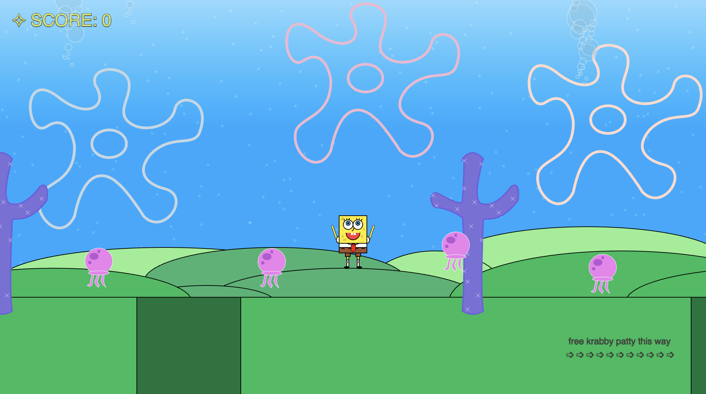

# Parmis Hosseini Khah

### About
I am currently pursuing a Computer Science degree at Goldsmiths, University of London. With a strong passion for innovation through coding, design, and digital creation, I am a driven and adaptable individual committed to continuous learning. My experience in retail and online media has developed my skills in customer service, teamwork, time management, problem-solving, and technical proficiency, all of which I am eager to expand further in a tech-focused environment.

### Education
Goldsmiths University of London
- BSc Computer Science, 2022-2025
Westminster Kingsway College
- BTEC Level 3 ICT, 2020-2022

### Skills 
- Software Development
- Web Development
- Front-end
- Back-end
- 3D Modeling

### Languages
- JavaScript
- Java
- Python
- HTML
- CSS
- SQL

### Work Experience
- Industrial Placement: The Wick and The Loco.co, March 2021 - July 2021
- Internship Experience: IEUK Bright Network, June 2024

### Projects
Year 1
- Game project
  
- Portfolio front-end web: https://doc.gold.ac.uk/~phoss001/portfolio/
  
- Paint app
- Graphics?
Year 2
- Forum app
- Group project

### Contacts
Linkedin: https://www.linkedin.com/in/parmis-hosseini-khah-55308b29a/
Github: https://github.com/parmisx/
Email: parmisxhk@gmail.com
Youtube: https://www.youtube.com/@Parmisxhk
