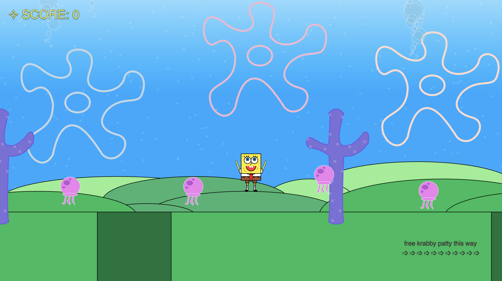
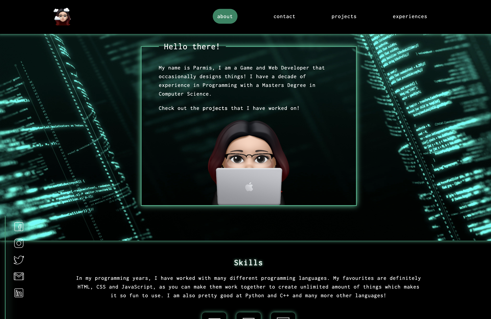
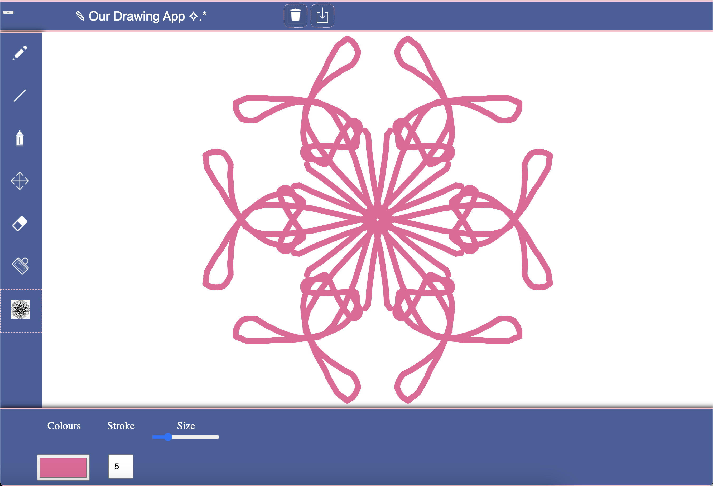
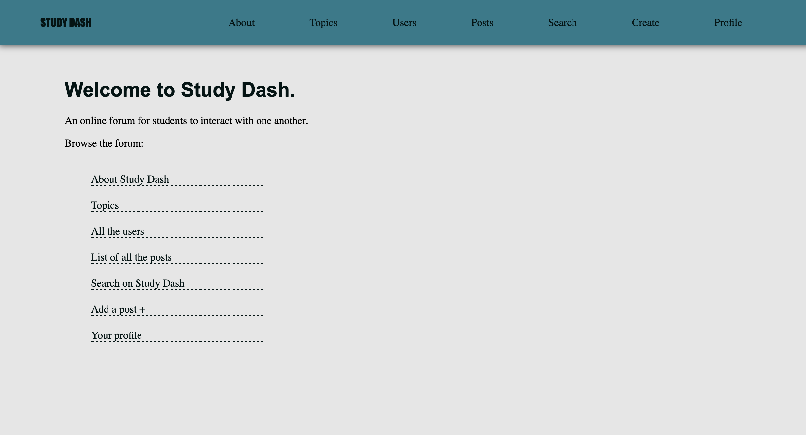
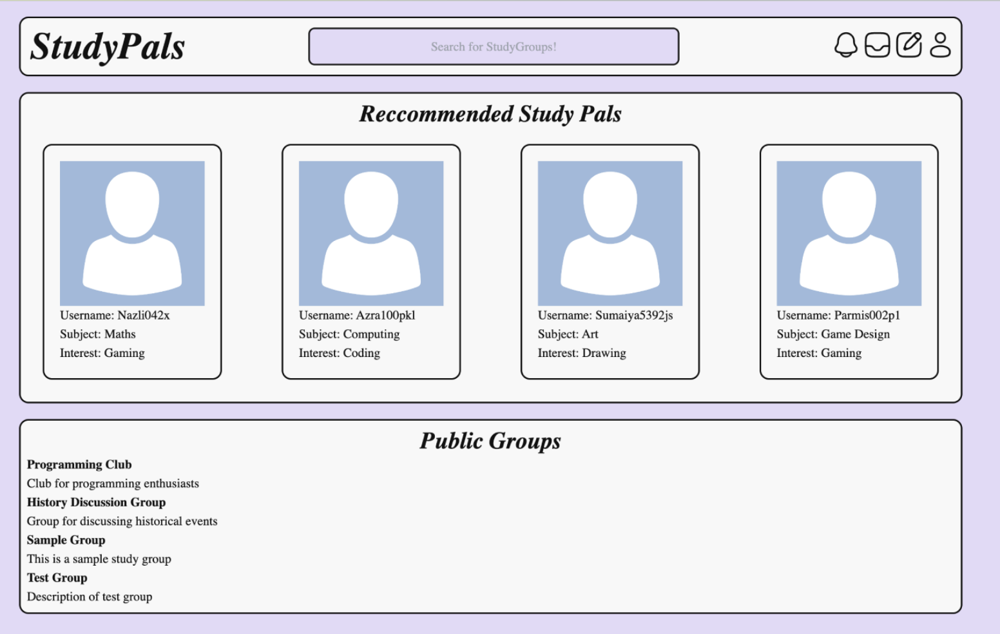
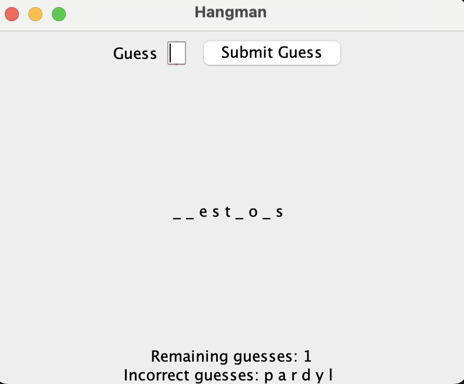

# Parmis Hosseini Khah

## About
I am currently pursuing a Computer Science degree at Goldsmiths, University of London. With a strong passion for innovation through coding, design, and digital creation, I am a driven and adaptable individual committed to continuous learning. My experience in retail and online media has developed my skills in customer service, teamwork, time management, problem-solving, and technical proficiency, all of which I am eager to expand further in a tech-focused environment.

## Education
### Goldsmiths University of London
- BSc Computer Science, 2022-2025
  
### Westminster Kingsway College
- BTEC Level 3 ICT, 2020-2022

## Skills 
- Software Development
- Web Development
- Front-end
- Back-end
- Blender (3D Modeling)

## Languages
- JavaScript
- Java
- Python
- HTML
- CSS
- SQL

## Work Experience
- Industrial Placement: The Wick and The Loco.co, March 2021 - July 2021
- Internship Experience: IEUK Bright Network, June 2024

## Projects
Click on the images for videos of them!

### Year 1
#### Spongebob Game Project - December 2022
A Spongebob-themed game similar to Mario.  
Skills developed and outcomes:
- Understanding the basic ideas of programming, including variables and memory.
- Designing and implementing a small program that uses simple control structures, including loops using JavaScript within the p5.js framework.
- Developing a programme with several interacting classes and objects.

#### Front-end Web Portfolio ([here](https://doc.gold.ac.uk/~phoss001/portfolio/)) - January 2023
A portfolio of me in 10 years to demonstrate my front-end skills.  
Skills developed and outcomes:
- Implementation of client-side web-based applications and understanding of front-end development.
- Use of HTML5 and CSS3 and manipulating the HTML and DOMO using Javascript.
- Creating interactive and responsive websites.

#### Drawing and Paint App - May 2023
A drawing and paint application using p5.js.  
Skills developed and outcomes:
- Providing useful functionality to a program.
- Applying programming techniques such as object orientation to create larger bodies of code.
- Understanding and applying project management and basic design techniques.
- Understanding techniques for testing usability and stability and applying these to the final program

#### Graphics
Skills developed and outcomes:
- Writing basic but complete graphics software systems.
- Procedurally manipulating digital media for use in creative contexts.
- Understanding and applying rudimentary image processing techniques.
- Understanding and applying basic geometrical transformations in 2D and 3D to create simple graphics.
##### Lab 2 of Graphics

##### Lab 3 of Graphics

### Year 2
#### StudyDash Forum App - December 2023
A forum app for students to create posts asking for help from other students.  
Skills developed and outcomes:
- Understanding client-server applications
- Building web-based applications.
- Developing an application that interacts with database servers.
- Database development using MySQL.
- Creating dynamic web applications which perform CRUD (create, read, update, delete) operations on databases.

#### StudyPals (Group project) - March 2024
A social media app for students to connect based on their subjects and interests.  
Skills developed and outcomes:
- Software project management and working in a team.
- Understanding methods involving users in design and demonstrating interface prototyping.
- Research the technical, social and creative context of a particular software application and apply this research to software design.
- Designing and implementing software that fits a particular user need and that demonstrates a clear aesthetic design.

#### Hangman Game - May 2024
A mini hangman game made in Java!  
Skills developed and outcomes:
- Developing a program in Java
- Understanding and usage of GUI in Java
- Designing and implementing software within the object-oriented paradigm using abstract classes and polymorphism

## Contacts
### Email: parmisxhk@gmail.com

